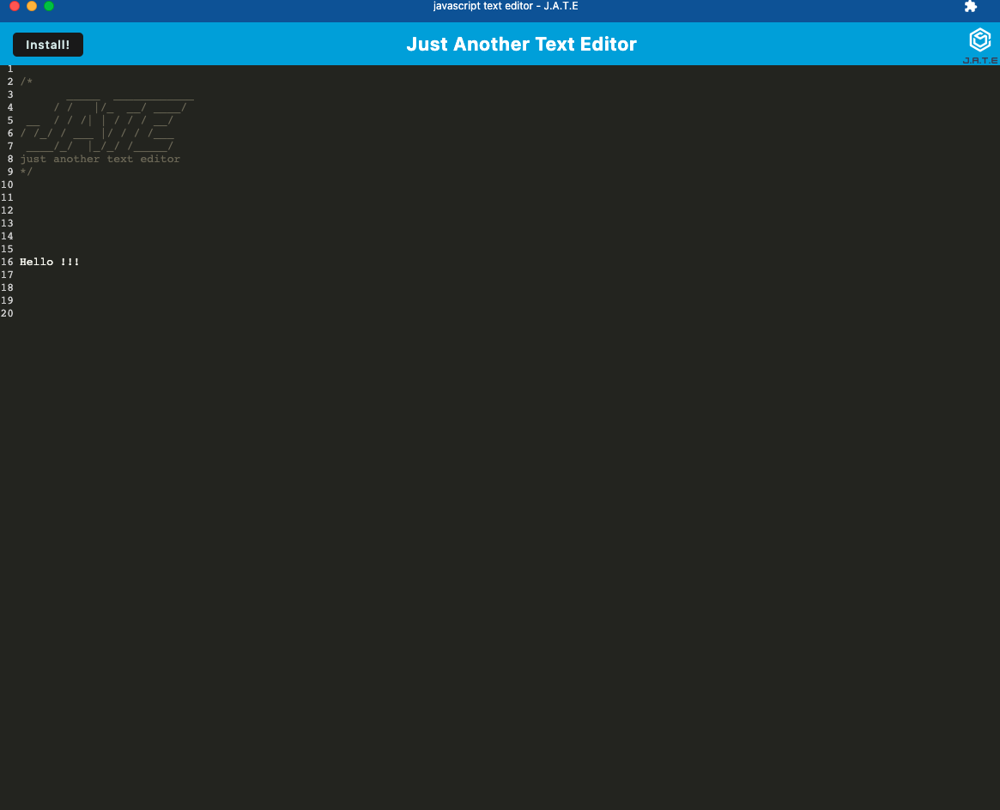

# JATE PWA 

## Description 
A text editor that can be installed and used offline

## Table of Contents

 [Installation](#Installation)

    
 [Screenshots](#Screenshots)

    
 [Credits](#Credits)

    
 [Questions](#Questions)

## Installation
You can use this text editor on your browser https://module-19-app.herokuapp.com/ or you can press the install! button and use it without connection

## Screenshots

## Contributing
Starter Code: https://github.com/coding-boot-camp/cautious-meme

## Questions

Have questions? Email me at adenamarom@gmail.com or find me on ![GitHub] (https://github.com/AdMarom)!